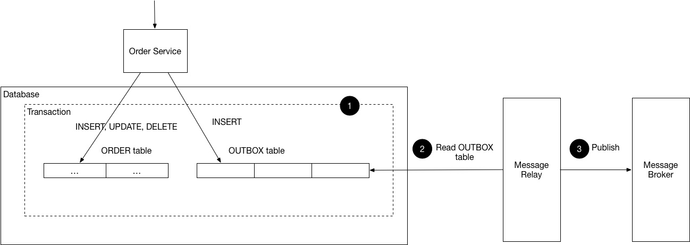

# Transactional Outbox

Transactional Outbox（事务性发件箱）是一种可靠发布消息的通用架构模式。它解决的是“双写”问题：业务事务需要同时更新数据库并发送消息，如果两步之间任一步失败，就可能出现业务数据和消息系统不一致。

权威参考：

- [microservices.io - Transactional Outbox](https://microservices.io/patterns/data/transactional-outbox.html)
- [AWS Prescriptive Guidance - Transactional outbox pattern](https://docs.aws.amazon.com/prescriptive-guidance/latest/cloud-design-patterns/transactional-outbox.html)
- [Microsoft Learn - Transactional Outbox Pattern](https://learn.microsoft.com/en-us/azure/architecture/databases/guide/transactional-out-box-cosmos)
- [Debezium - Outbox Event Router](https://debezium.io/documentation/reference/stable/transformations/outbox-event-router.html)

## 什么时候使用

只在需要把领域事件可靠投递到进程外系统时使用 Outbox，例如 Kafka、RabbitMQ、异步集成、跨服务通知、失败重试和最终一致性链路。如果事件只需要进程内 Spring 监听器处理，不需要配置 Outbox。



## jfoundry 事件链路

业务侧在应用服务上标注 `@ApplicationService` 后，框架会在成功返回的应用服务边界自动 drain 聚合记录的领域事件，并通过 `DomainEventDispatcher` 分发。默认 Spring dispatcher 会先调用 `DomainEventOutboxRecorder` 在事务内写 Outbox，再通过 `ApplicationEventPublisher` 安排 Spring 进程内事件发布。这里有一个边界要点：

- `jfoundry-domain` 定义领域事件抽象与聚合事件记录能力
- `jfoundry-messaging-core` 定义应用层事件分发契约、领域事件外部化规则、路由元数据和消息发送 SPI
- `jfoundry-messaging-spring` 提供 Spring `DomainEventDispatcher` 实现
- `jfoundry-outbox-spring` 提供默认 `DomainEventOutboxRecorder` 实现，把匹配规则的领域事件写入 Outbox

jfoundry 内置的 `DefaultDomainEventOutboxRecorder` 只处理标记了 `@Externalized` 的事件，并把匹配的事件序列化写入 Outbox 表。

jfoundry 当前实现的是 Transactional Outbox 的 polling publisher 变体：业务事务写入 `jfoundry_outbox_event`，后台 dispatcher 轮询并投递。transaction-log tailing / Debezium 不属于默认运行时；如果业务需要基于数据库日志的发布链路，应在应用外部组合 Debezium Outbox Event Router。

典型链路：

```text
@ApplicationService
  -> DomainEventContext
  -> DomainEventDispatcher
  -> DomainEventOutboxRecorder
  -> OutboxMessageStore
  -> jfoundry_outbox_event
  -> OutboxDispatcher
  -> MessageSender
  -> MQ / external system
```

Outbox 记录会携带 broker-neutral 的 aggregate metadata（`aggregate_type`、`aggregate_id`、`aggregate_version`），用于路由、观测或下游顺序控制。它不绑定 Kafka、RabbitMQ 或其他 MQ。

## 标记外部化事件

`@Externalized` 决定事件是否参与外部化；`@MessageRouting` 可提供更明确的 topic 和 routing key。

```java
@Externalized("order.created")
@MessageRouting(topic = "order.created", key = "orderId")
public final class OrderCreatedEvent extends AbstractDomainEvent {
    private final String orderId;

    public OrderCreatedEvent(String orderId) {
        this.orderId = orderId;
    }

    public String getOrderId() {
        return orderId;
    }
}
```

如果只标记 `@MessageRouting` 而没有 `@Externalized`，事件不会写入 Outbox。

## 配置

Outbox 是可选能力。业务侧需要可靠外部化时引入 `jfoundry-spring-boot-starter-outbox`；如果需要 MyBatis-Plus 的 Outbox 存储，再引入 `jfoundry-spring-boot-starter-outbox-mybatis-plus`。后者会通过 MyBatis-Plus 适配器提供 `OutboxMessageStore`，表名默认为 `jfoundry_outbox_event`。如需自定义表名，设置 `jfoundry.outbox.table-name`，并由业务侧创建同结构表。

```yaml
jfoundry:
  outbox:
    table-name: jfoundry_outbox_event
    dispatcher:
      enabled: true
      mode: scheduled
      interval-ms: 5000
      batch-size: 50
      max-retries: 5
      backoff-base-ms: 1000
      backoff-max-ms: 300000
    recovery:
      interval: 60s
      stuck-timeout: 5m
    cleanup:
      enabled: true
      interval: 24h
      published-retention-days: 7
      dead-lettered-retention-days: 30
      batch-size: 1000
```

`mode: jobrunr` 可切换到 JobRunr 派发器，需要额外引入 `jfoundry-spring-boot-starter-outbox-jobrunr`。

## Broker adapter

Outbox starter 不携带具体 broker 客户端。未提供 `MessageSender` 时，jfoundry 使用 logging sender
记录消息内容，但它会返回失败结果，不会让 dispatcher 把消息标记为 `PUBLISHED`。生产环境如启用
Outbox 外部化，必须提供真实 `MessageSender`；没有外部投递需求时，应关闭 dispatcher 或不要标记事件为外部化。

Kafka 是当前内置的第一个真实 broker adapter。业务侧显式引入 `jfoundry-spring-boot-starter-messaging-kafka` 并提供 `KafkaTemplate<String, String>` 后，`KafkaMessageSender` 会把 `MessageSender` 的 `topic`、`key`、`payload` 分别映射为 Kafka 的 topic、key、value。未来增加 RabbitMQ、RocketMQ 等 adapter 时，只需实现同一个 `MessageSender` SPI，不需要改 Outbox 本体。

## 表结构与迁移

MySQL 脚本位于：

```text
jfoundry-infrastructure/jfoundry-outbox-mybatis-plus/src/main/resources/db/migration/V20260617__create_outbox_event.sql
```

达梦 DM 脚本位于：

```text
jfoundry-infrastructure/jfoundry-outbox-mybatis-plus/src/main/resources/db/migration/V20260617__create_outbox_event_dm.sql
```

业务项目可通过 Flyway、Liquibase 或手工 DDL 创建表。核心字段包括 `event_id`、`topic`、`payload_key`、`payload_type`、`payload_json`、`aggregate_type`、`aggregate_id`、`aggregate_version`、`status`、重试字段和 claim 字段。

## 状态语义

- `PENDING`：已写入 Outbox，等待派发。
- `DISPATCHING`：已被某个派发器实例 claim，正在投递。
- `PUBLISHED`：投递成功。
- `FAILED`：本次投递失败，等待下次重试。
- `DEAD_LETTERED`：超过最大重试次数，进入死信状态。

派发器通过原子 claim 避免多实例重复取同一批记录。恢复任务会把长时间停留在 `DISPATCHING` 的记录回滚为 `PENDING`，清理任务只删除过期的 `PUBLISHED` 和 `DEAD_LETTERED` 终态记录。

## 使用建议

消费者应按 `event_id` 或业务消息 id 做幂等处理。Outbox 能保证业务数据和待投递消息在同一数据库事务内落库，但消息系统仍可能出现重复投递、消费端重试或下游局部失败。业务侧的 `MessageSender` 实现应只负责向具体 MQ 发送消息，并把失败结果返回给 dispatcher。

`jfoundry-spring-boot-starter-inbox` 会在业务侧存在 `InboxMessageStore` Bean 时装配 `InboxTemplate`。MyBatis-Plus 项目可引入 `jfoundry-spring-boot-starter-inbox-mybatis-plus` 提供 MyBatis-Plus `InboxMessageStore`。消费者可以用 `executeOnce(...)` 包住处理逻辑；MyBatis-Plus 适配器会先按 `messageId + consumerName` 抢占 `PROCESSING` 记录，成功后标记 `PROCESSED`，失败后标记 `FAILED`，并发重复投递时只有抢占成功的一方会执行 handler：

```java
inboxTemplate.executeOnce(eventId, "order-projection", () -> {
    handler.handle(event);
});
```

默认 Inbox 表名是 `jfoundry_inbox_message`，迁移脚本位于：

```text
jfoundry-infrastructure/jfoundry-inbox-mybatis-plus/src/main/resources/db/migration/V20260624__create_inbox_message.sql
```
